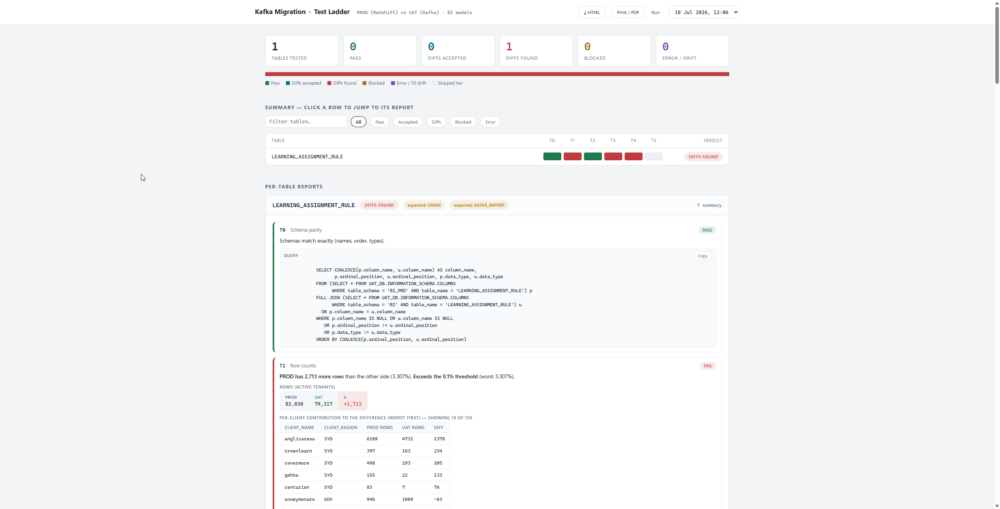

# Kafka Migration Testing — automated test ladder

Runs the T0–T5 ladder from the EDATA "Kafka Migration Testing" plan against
Snowflake for a configured list of tables, and writes a tracker-ready summary.

## Setup

```powershell
pip install snowflake-connector-python pyyaml
```

Copy `.env.example` to `.env` (it's prefilled with your account/user/warehouse)
and keep `SNOWFLAKE_AUTHENTICATOR=externalbrowser` for SSO — the first connect
opens your browser once, and the token is cached locally
(`client_store_temporary_credential`) so subsequent runs don't re-prompt.

Alternatives, if SSO isn't wanted: set `SNOWFLAKE_PASSWORD`, or
`SNOWFLAKE_PRIVATE_KEY_PATH` (+ optional passphrase, requires
`pip install cryptography`). Real environment variables always override `.env`.
`SNOWFLAKE_DATABASE`/`SCHEMA` aren't needed — every query is fully qualified
from `config.yaml`.

Edit `config.yaml`:
- `environments.prod_db` / `uat_db` — real database names
- `connection.role` / `warehouse` if your defaults aren't right
- fill in `grain:` per table from the CRT-6248 grain page as you go

## Dashboard preview

The generated dashboard provides a tracker-friendly view of the migration test results.



### What the dashboard includes

- A summary matrix for every table across the test ladder (T0-T5)
- Per-table detail sections for schema drift, row-count diffs, grain checks, and full-row comparisons
- Column-level drift drill-downs for mismatches that need investigation
- Sample rows and SQL snippets to help triage issues quickly
- Run history so you can compare results across multiple executions
- A self-contained HTML report that can be opened directly from disk

## Run

```powershell
# Everything in the config
python runner.py

# Preview all generated SQL without connecting (review before first live run)
python runner.py --dry-run

# One table
python runner.py --tables LEARNING_ENROLMENT

# Mutliple tables
python runner.py --tables LEARNING_ENROLMENT,LEARNING_ASSIGNMENT_RULE
```

## What it does per table (mirrors the plan)

1. Checks the table exists on both sides; if absent in UAT → verdict **BLOCKED**
   (consistent with "BLOCKED ON KAFKA IMPORT") and stops.
2. **T0** schema parity — any drift stops the ladder for that table.
3. **T1** row counts (active tenants only).
4. **T2a/T2b** grain uniqueness + key-set diff both directions — only when
   `grain:` is set. If the configured grain is not unique, T4 is withheld.
5. **T3** full-row `EXCEPT`, **both directions**, using a normalised projection
   generated from `INFORMATION_SCHEMA` (TEXT → `NULLIF(col,'')`, optional
   `TRIM`; everything else raw). Use `projection_override` to paste the exact
   projection from `bi_comparison.sql` instead.
6. **T4** column-level `COUNT_IF(NOT EQUAL_NULL(...))` diff — generated in
   Python, key columns excluded — only when T3 is non-zero and grain is unique.
7. **T5** `HASH_AGG` fingerprint — when T3 is clean (or `always_fingerprint`).

## Outputs (per run, in `results_<timestamp>/`)

- `summary.md` — tracker-ready matrix (paste into Confluence) + per-table detail
- `results.json` — full machine-readable results
- `queries.sql` — every statement executed, for audit / re-running by hand
- `samples/<table>_<direction>.csv` — up to 25 offending rows per direction
  when T3 is non-zero

## Triage reminders (doc §7)

- Diffs that vanish under `NULLIF` = the known Kafka blank/NULL quirk — accepted.
- Quiz data: PROD-only rows are a known PROD defect (records absent from TMS).
- Stale PROD data from the 29/04–06/05 DMS failure can explain PROD-side drift.
- Small key-set drift is expected — the environments weren't snapshotted at the
  same instant.

## Full-schema config & blocked-table skipping

`config.yaml` now covers all 116 BI models with grains from CRT-6248 and
blocked flags from the master tracker (`KAFKA_IMPORT`, `GRAIN`, `REMOVAL`).

- `defaults.skip_blocked: [KAFKA_IMPORT, REMOVAL]` — these are skipped at
  runtime but still appear in the report as BLOCKED. GRAIN is not skipped by
  default: those tables still produce useful T0/T1/T3/T5 results.
- `--skip-blocked KAFKA_IMPORT,REMOVAL,GRAIN` — override per run
- `--run-all` — ignore skipping entirely
- `--tables X,Y` — explicitly named tables always run, even if blocked
- `tenant_join: false` (per table) — disables the active-tenants join for
  tables without client columns (currently GLOBAL_CONSOLIDATED_REFERENCE)
